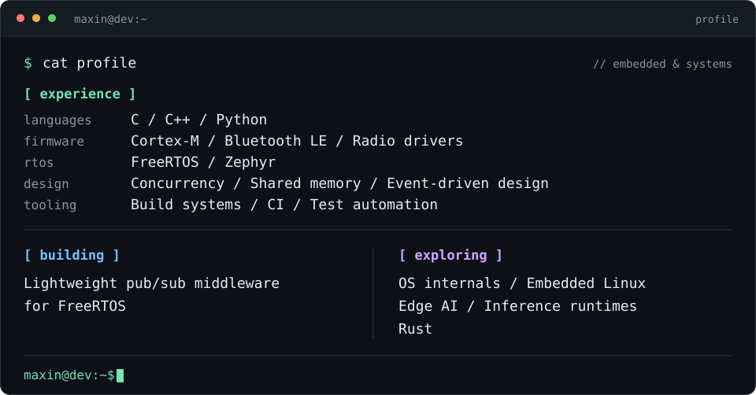

# Hi, I am Maxin 👋

**Embedded software engineer.** I design and build systems to solve real-world engineering problems.

<picture>
  <source media="(max-width: 600px)" srcset="assets/profile-mobile.svg">
  
</picture>
